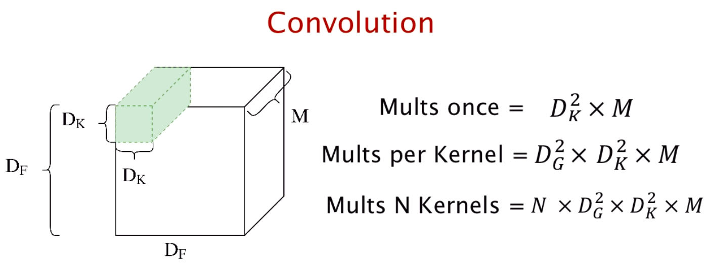
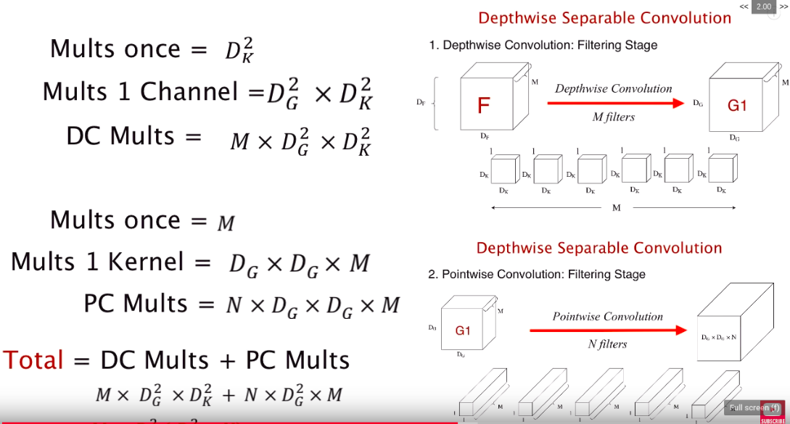
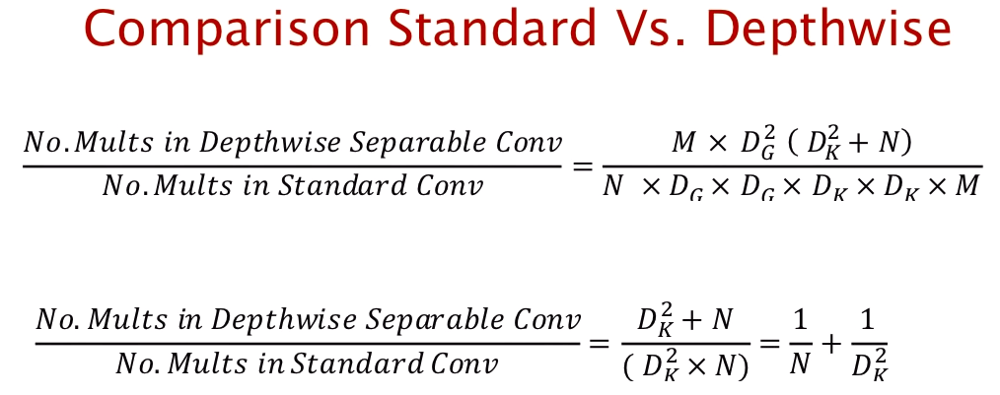
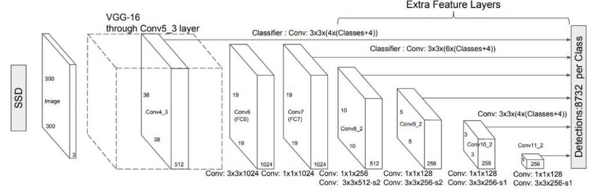

# Object Detection with MobileNet SSD

SSD object detection with pretrained MobileNet for feature extraction borowed from [here](https://github.com/chuanqi305/MobileNet-SSD). The aim for this implementation is for real-time webcam object detection with higher FPS than what was achieved with YOLO. I chose MobileNet feature extraction and shrinked the model's input size to 400x720 pixels to increase the FPS of detection. A driving video is used to evaluate its performance. Also, I used MobileNet once more in [this project](https://github.com/Jacklu0831/Classify-Anything), which is also in real-time setting except that I added a KNN classifier on top. 

Note that I did not build and train the models in this repo since my primary focus was to test out performances of different models, become robust with OpenCV (images, videos, draw boxes, preprocess), and also to find out how good is my laptop at handling live object detection. For my own models, just refer to most of my other repos such as [SRGAN](https://github.com/Jacklu0831/Super-Resolution-GAN). 

---

## Performance (real-time)

Below are screen-captured videos that let me and you really see how fast the frame rate produced is. The reasons (the math) behind why MobileNet SSD is fast will be explained in the Background section below. 

<h3 align="center"><b>SSD - avg 14.56 FPS</b></h3>

<image src="vid_live/ssd.gif" width="50%" height="50%"></image>

**Frames per Second**

Note that the FPS is only how fast my laptop is able to handle the job. With the right GPU or even better CPU, I'm sure that the FPS would rise even higher. MobileNet is designed for being able to process video frames without demanding a high computational expense, which is very suitable for real-time object detection on resource constrained devices such as laptops or even phones. 

**Accuracy**

As seen in the video, the accuracy of the model is accurate within only a very limited range while further objects are barely detected at all. This is due to the model not being trained enough on the domain of car roof driving photos and the limitations from MobileNet being light weight. Side note, in [this related project](https://github.com/Jacklu0831/Classify-Anything), I laid a KNN classifier on top of MobileNet to make very accurate object classifications with transfer learning. 

---

## Background

### What is MobileNet

Quoting [this paper](https://arxiv.org/abs/1704.04861) in 2017 from Google, MobileNet is:
> A class of efficient models for mobile and embedded vision applications.

However, why is it fast? At first I just regarded it as due to having less layers. While that is certainly part of the reason, after reading [the paper](https://arxiv.org/pdf/1704.04861.pdf), I found out the dominant contributor to MobileNet's speed is much more interesting and less detrimental to accuracy than just chopping off layers. Below is a copy of the README I wrote for [Classify-Anything!](https://github.com/Jacklu0831/Classify-Anything) explaining MobileNet's usage of **Depthwise Separable Convolution**. 

Depthwise Separable Convolution breaks down the standard convolution into two parts. It first uses a depthwise convolution (filtering stage) and then uses a pointwise convolution (combining stage). Let's compare the computational expense of using Standard Convolution and Depthwise Separable Convolution.

</img>

Based on the parameters in the picture above (note Dg is simply the size length of output), in the standard convolution, N number of kernels perform convolution on M channels of the Df by Df tensor EACH. Therefore, if I apply 32 number of 3x3 kernels to a 128x128 colored image, it will result in the expense of `32x(126x126)x(3x3)x3 = 13716864` multiplications.

</img>

Depthwise separable convolution can be broken into two stages. The first stage is depthwise convolution, where M number of kernels with depth of 1 each are applied to each layer of the input tensor, decreasing the expense by a factor of N. Then, the pointwise convolution uses N number of 1x1xM "stick-like" kernels to integrate the info that the channels of the output of depthwise convolution carries. The final output tensor results in the same size as the standard convolution. Adding the two stages up, the same scenario as calculated above could take `(126x126)x(3x3)x3 + 32x(126x126)x3 = 1952748` multiplications. If we divide it by the standard, in this case, depthwise convolution only takes `14.2%` of the expense! 

</img>

Of course, a generalized formula is always better. Based on the derived formula above, `1/32 + 1/(3x3) = 14.2%`. Real convolutional neural networks contain much bigger numbers and often also sizes of kernels, which only magnifies the differences between the expense of using standard convolutional layers and depthwise separable convolutional layers. 

### What is SSD

SSD stands for single shot detector and in this project, it is used on top of the features extracted by MobileNet. Instead of just reducing the images' spatial dimentions until the second last layer is ready for classification, SSD uses multi-scale feature maps to detect objects independently. 

</img>

There are 6 SSD layers above the MobileNet model (above pic is with VGG16 but let's pretend its MobileNet), bounding boxes are predicted from each of the 5 layers (last one for classification) and all of them are kept track of. This is called **multi-scale feature maps**. Typically, the larger layers predict details while the resolution decrease each layer to predict larger objects in the picture. With more bounding boxes from different feature map sizes, SSD attains better coverage of location and is less likely to miss objects. Of course, filtering out predictions with low confidence and performing non-maximum suppression (explained in [YOLO](https://github.com/Jacklu0831/Real-Time-Object-Detection/tree/master/1_YOLO)) were both applied.

### Model Architecture

<image src="assets/mobilenet_model.png" width="75%" height="75%"></image>

Shown in the image above, MobileNet has around 20 convolutional layers and only one fully-connected layer. If you look closely at the picture above, the kernel sizes reflects that MobileNet heavily replies on the efficiency of depthwise separable convolutional layers. The structure of the SSD layers are shown in the previous subsection.

---

## Files

<pre>
README.md       - `self`
SSD_live.py     - Implementation: real-time webcam detection with SSD
vid_live        - Directory for output saved live outputs
MobileNetSSD    - Directory for the weights and config of the MobileNetSSD model (Caffe)
assets          - Some pictures for README
</pre>

---

## How to Use

Run python script in command line.

`python SSD_live.py`

---

## Resources

- [MobileNets: Efficient Convolutional Neural Networks for Mobile Vision Applications](https://arxiv.org/pdf/1704.04861.pdf)
- [MobileNet SSD trained model](https://github.com/chuanqi305/MobileNet-SSD)
- [OpenCV Tutorials](https://www.pyimagesearch.com/start-here-learn-computer-vision-opencv/)
- [YOLO vs. SSD Blog](https://technostacks.com/blog/yolo-vs-ssd/)
- [Learned a lot from this book's SSD section](https://www.d2l.ai/chapter_computer-vision/ssd.html)
